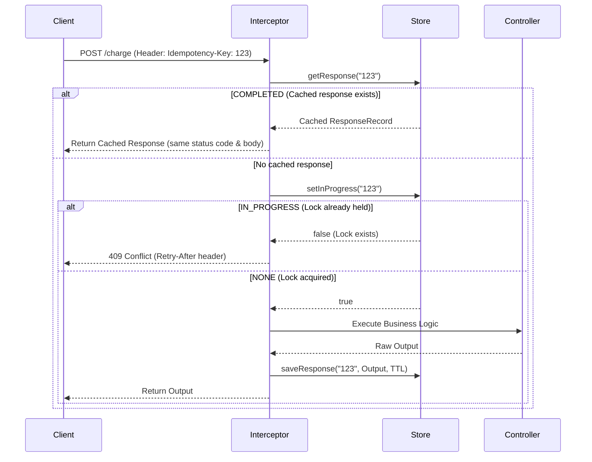

# Architecture & Design Decisions: `@mohamedsaba/idempotent`

## 1. System Philosophy
This library was extracted from a high-performance, distributed Webhook Engine. It is designed to solve a fundamental distributed systems problem — network instability and client retry storms — without polluting core domain logic.

**Design Tenets:**
* **Declarative:** Engineers should only need to add `@Idempotent()` to a route.
* **Pluggable:** Storage must be abstracted. Local dev uses an in-memory store; production horizontally scales with Redis.
* **Atomic:** Race conditions from concurrent requests must be structurally impossible.
* **Transparent:** The library must not alter the shape of successful or failed responses.

---

## 2. Component Breakdown

### A. The Decorator (`@Idempotent()`)
A custom method decorator that attaches metadata (TTL, key extraction strategy) to the route handler via NestJS `SetMetadata`. The interceptor reads this metadata at runtime through the `Reflector` API. Without the decorator present, the interceptor is a no-op.

### B. The Module (`IdempotencyModule`)
A NestJS dynamic module that accepts configuration (store type, default TTL, key header name) and wires all providers together. Exposes a `forRoot()` / `forRootAsync()` pattern for synchronous and asynchronous registration.

### C. The Interceptor (`IdempotencyInterceptor`)
The brain of the module. Built on NestJS `CallHandler` and `ExecutionContext`, it intercepts the incoming request before it hits the controller and intercepts the outgoing response before it hits the network. It reads the idempotency key from the request, delegates to the store, and decides whether to execute, reject, or replay.

### D. The Storage Abstraction (`IdempotencyStore`)
An abstract class defining a strict contract:

```typescript
export abstract class IdempotencyStore {
  abstract setInProgress(key: string, ttl: number, token: string): Promise<boolean>;
  abstract saveResponse(key: string, response: ResponseRecord, ttl: number, token: string): Promise<void>;
  abstract getResponse(key: string): Promise<ResponseRecord | string | null>;
  abstract clear(key: string, token?: string): Promise<void>;
}
```

This Inversion of Control (IoC) allows injecting `MemoryStore` or `RedisStore` seamlessly via NestJS custom providers.

### E. The Memory Store (`MemoryStore`)
An in-memory implementation backed by a `Map` with TTL-based expiration. Intended for local development, testing, and single-instance deployments only. Not suitable for horizontally scaled environments since state is not shared across processes.

### F. The Redis Engine (`RedisStore`)
The production engine. Utilizes `ioredis` to execute atomic operations. It leverages Redis `SETNX` (Set if Not eXists) or custom Lua scripts to guarantee that if two identical requests arrive at the exact same millisecond, only one successfully sets the `IN_PROGRESS` flag.

---

## 3. Idempotency Key Extraction

The idempotency key is resolved in the following order of precedence:

1. **Custom Extractor:** A function passed to `@Idempotent({ keyExtractor: (req) => ... })` for cases where the key must be derived from the request body or route params.
2. **Header-Based (Default):** The value of the `Idempotency-Key` HTTP header (configurable at the module level).
3. **Missing Key:** If no key is found and the decorator is present, the request is rejected with a `400 Bad Request` to prevent silent bypass of idempotency guarantees.

---

## 4. Request Lifecycle



---

## 5. Edge Cases & Resiliency

### A. Route Failures (5xx Errors)
If the route handler throws an exception (e.g., database is down), the RxJS `catchError` pipe triggers. The interceptor automatically calls `Store.clear(key)` to release the lock and discard any partial state, so the client's subsequent retry can re-attempt the logic rather than being stuck on a cached failure.

### B. The "In-Progress" Race
If a client sends an identical request while the first is still executing, the store's `setInProgress` atomically rejects the second caller. The interceptor returns a `409 Conflict` with an optional `Retry-After` header.

### C. Memory Leaks / Key Expiration
Every saved response requires a TTL (Time-To-Live). The `RedisStore` delegates expiration to Redis natively (`PEXPIRE`). The `MemoryStore` runs a periodic sweep or uses lazy expiration on access. This ensures storage does not grow unbounded.

### D. Store Unavailability
If the Redis connection is lost, the `RedisStore` should either:
* **Fail open:** Allow the request through without idempotency protection (availability over correctness).
* **Fail closed:** Reject the request with a `503 Service Unavailable` (correctness over availability).

The chosen strategy is configurable at the module level. The default is fail-closed to prevent duplicate side effects.

### E. Fingerprint Mismatch
If a client reuses the same idempotency key with a different request body, the interceptor detects the mismatch via a robust, cycle-safe hashing algorithm and returns a `422 Unprocessable Entity` to prevent accidental key collisions.

### F. Lock Hijacking (Fencing Tokens)
If Request A's lock expires before it finishes, and Request B starts with the same key, Request A is prevented from overwriting Request B's state. This is achieved by generating a unique **Fencing Token** for every request and verifying it in the `saveResponse` and `clear` operations.

---

## 6. Scaling & Hardening Refinements

To ensure readiness for high-throughput and multi-tenant production environments, the following refinements are implemented/planned:

### A. Observability & Logging
Integration of the NestJS `Logger` to provide transparent visibility into the request lifecycle.
* **Logs:** Cache hits, conflicts (409), fingerprint mismatches (422), and storage failures.
* **Benefit:** Simplifies debugging in distributed environments where tracing a "Missing Key" or "Conflict" is critical.

### B. MemoryStore Optimization
Transitioning from aggressive cleanup to **Lazy Expiration** and **Periodic Background Sweeps**.
* **Impact:** Removes the $O(N)$ iteration cost from the critical request path, ensuring $O(1)$ performance even with hundreds of thousands of keys.

### C. Payload Protection
Implementation of `maxBodySize` constraints.
* **Purpose:** Prevents storage exhaustion in Redis or Node.js memory by skipping idempotency for abnormally large request/response bodies.

### D. Status Code Filtering
Granular control via `cacheableStatuses`.
* **Purpose:** Allows developers to specify that only successful responses (e.g., 2xx) should be cached, preventing transient errors (e.g., 404 or 429) from being persisted as "successful" idempotent results.

### E. Background Save Resilience
Ensuring that the asynchronous storage of the response does not block or fail the primary request/response stream, while maintaining consistency of the `IN_PROGRESS` lock state.
